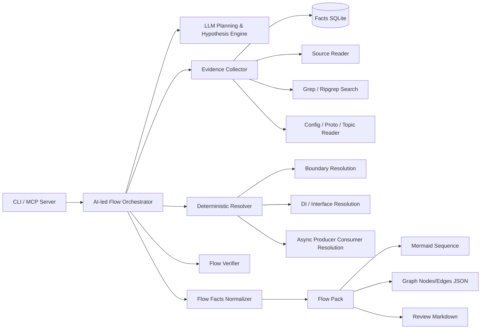
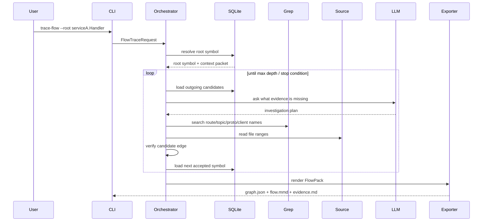
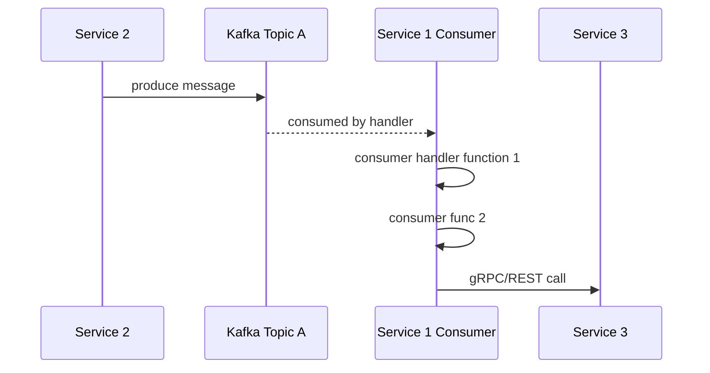

# AI-led Flow Architecture Decision Record

## 1. Purpose

This document consolidates the agreed architecture direction for `anhnd3/code_analysis` after retiring the MVP legacy graph/reviewflow path and stabilizing the facts-first foundation.

The next phase is to evolve the project into an AI-led local SDLC evidence engine that can deeply analyze function dependency flows across multiple microservices and export evidence-backed graph and Mermaid artifacts.

The product should support both synchronous and asynchronous software flows, including internal function calls, REST/gRPC boundaries, producers, consumers, Kafka/RabbitMQ topics, and cross-service continuation.

---

## 2. Final Product Goal

The target product is a local analysis module that can answer questions such as:

- From this function, what functions are called next?
- Which service boundary does this REST/gRPC call cross?
- Which server handler receives this request?
- Which Kafka/RabbitMQ topic is produced?
- Which consumer subscribes to this topic?
- What is the full evidence-backed flow across repositories and services?
- What Mermaid sequence diagram or graph nodes/edges represent this flow?

The primary output types are:

```text
1. Function dependency graph
2. Cross-service Mermaid sequence diagram
3. Async producer/consumer flow diagram
4. Evidence-backed Flow Pack
5. Optional component/module Mermaid chart
6. MCP tool responses for other agents
```

The product should remain CLI-first, then expose MCP tools so other AI agents can use the analysis capability.

---

## 3. Key Architecture Decision

The architecture is not “AST graph as final truth.”

The final architecture is:

```text
AST facts
+ source evidence
+ grep/search evidence
+ config/proto/topic evidence
+ LLM planning/review
= evidence-backed Flow Pack
```

The LLM is not the source of truth. The LLM is used as a planner, resolver assistant, and ambiguity reviewer. Every accepted edge must be backed by deterministic evidence.

Final rule:

```text
No evidence, no accepted edge.
```

If the system cannot verify an edge, it may keep the edge as ambiguous, but it must not silently turn a hypothesis into a confirmed flow.

---

## 4. Current Repository Baseline

The repository has already moved into a facts-first direction.

The active product surface is now:

```text
scan -> index -> inspect-function -> review-flow -> export-md/export-mermaid/export-graphjson
```

The currently retained foundation is:

```text
scanner
extractor
facts_index
store/sqlite
query
review
export/markdown
export/mermaid
```

The current codebase already supports:

- Workspace scanning
- Repository/service/file discovery
- Tree-sitter-based extraction
- Fact model creation
- SQLite and JSONL persistence
- Bounded function inspection
- Basic LLM-led review flow
- Markdown and Mermaid export from reviewed flow

The retired legacy graph/reviewflow path should not be revived. Future capability should build above the current facts-first foundation.

---

## 5. High-level Architecture



---

## 6. Main Components and Boundaries

### 6.1 Existing Foundation Layer

The existing deterministic foundation remains responsible for extracting and storing raw facts.

Responsibilities:

```text
Read workspace
Discover repositories/services/files
Extract symbols/imports/exports/call candidates
Detect basic boundaries
Persist facts into SQLite/JSONL
Provide bounded function context packets
```

This layer should stay deterministic. It should not depend on LLM reasoning.

Recommended packages to keep as foundation:

```text
internal/app
internal/indexer
internal/indexer/detector
internal/indexer/extractor/go
internal/indexer/extractor/python
internal/indexer/extractor/javascript
internal/indexer/extractor/treesitter
internal/indexer/boundary/go
internal/indexer/boundary/frameworks
internal/facts
internal/facts/sqlite
internal/facts/query
internal/review
internal/export (contains markdown, mermaid, graphjson services)
```

### 6.2 New AI-led Flow Orchestrator Layer

Add a new orchestrator package:

```text
internal/orchestrator/flowtrace
```

Responsibilities:

```text
Given a root symbol, endpoint, topic, or consumer:
1. Load deterministic facts.
2. Build the current investigation frontier.
3. Ask the LLM what evidence should be inspected next.
4. Execute deterministic evidence tools.
5. Resolve missing links with source/grep/config/proto/topic evidence.
6. Accept, reject, or mark ambiguous each edge.
7. Produce a normalized Flow Pack.
```

This layer coordinates the investigation. It does not own raw extraction and does not directly invent accepted edges.

### 6.3 Evidence Tool Layer

Add deterministic evidence tools:

```text
internal/evidence
```

Initial tools:

```text
ResolveSymbol
InspectFunction
ListOutgoingCandidates
ListIncomingCandidates
SearchText
ReadFileRange
FindRouteHandlers
FindGRPCClients
FindGRPCServers
FindProducers
FindConsumers
FindTopicConstants
FindConfigBindings
FindInterfaceImplementations
FindDIProviders
```

These tools should be callable by the orchestrator and later by MCP.

### 6.4 Flow Model Layer

Add product-level flow model types:

```text
internal/flowmodel
```

This layer is separate from raw AST facts. Raw facts describe extracted source information. Flow model describes the final reviewed product result.

Core model:

```text
FlowPack
FlowNode
FlowEdge
EvidenceItem
AmbiguityItem
DiagnosticItem
```

### 6.5 Resolver Layer

Add resolver components under the orchestrator or as separate services:

```text
internal/orchestrator/flowtrace/resolvers
```

Initial resolvers:

```text
LocalCallResolver
RESTBoundaryResolver
GRPCBoundaryResolver
ProducerResolver
ConsumerResolver
InterfaceResolver
DIResolver
ConfigResolver
```

The resolver layer is where AST facts are combined with source search, config search, route registration, proto definitions, and topic constants.

### 6.6 Verifier Layer

The verifier decides whether a proposed edge has enough evidence to be accepted.

Allowed statuses:

```text
accepted
ambiguous
rejected
```

Acceptance rule:

```text
An edge may be accepted only when it has at least one deterministic evidence item and passes resolver-specific validation.
```

LLM rationale alone is never enough.

### 6.7 Export Layer

Existing exports can be retained, but future exports should render from `FlowPack`, not directly from raw `ReviewFlow`.

Add:

```text
internal/export/flowpack
internal/export/sequence
internal/export/components
```

Target outputs:

```text
flow_pack.json
graph.json
flow.mmd
components.mmd
flow.md
evidence.md
uncertainty.md
```

### 6.8 MCP Layer

CLI remains first. MCP comes after the orchestrator is stable.

Add later:

```text
cmd/analysis-mcp
internal/mcp
```

MCP tools should expose:

```text
index_workspace
resolve_symbol
inspect_function
trace_flow
search_evidence
read_flow_pack
export_mermaid
```

---

## 7. Current Module Quality Assessment

### 7.1 Scanner

Current assessment:

```text
Foundation quality: 7/10
Product-level flow analysis quality: 5/10
```

Strengths:

```text
Multi-repository workspace discovery exists.
Language and service candidate discovery exists.
Ignored files and scan warnings are tracked.
Scan artifacts are persisted.
```

Limitations:

```text
Runtime service identity is still weak.
Service ownership is mostly structural, not semantic.
API boundary ownership needs enrichment.
Topic/queue ownership is not first-class yet.
```

Decision:

```text
Keep scanner as foundation. Do not rewrite it now.
Improve it later with runtime ownership, deployment/config hints, topic ownership, and stronger service boundary metadata.
```

### 7.2 Extractor

Current assessment:

```text
Go extractor: 7/10
Python extractor: 5.5/10
JS/TS extractor: 5.5/10
Cross-service flow readiness: 4.5/10
```

Strengths:

```text
Tree-sitter base is real.
Function/method symbols exist.
Imports and exports exist.
Call candidates exist.
Diagnostics exist.
Go async/control hints exist.
```

Limitations:

```text
Interface implementation resolution is incomplete.
Dependency injection resolution is incomplete.
gRPC server/client stitching is missing.
REST client/server stitching is missing.
Kafka/RabbitMQ producer-consumer stitching is missing.
Config/env/proto-based resolution is missing.
Cross-repo symbol identity is still limited.
```

Decision:

```text
Do not try to make AST extraction perfect first.
Use the current extractor as deterministic evidence source.
Add the AI-led orchestrator to handle broken links using search/source/config/proto evidence.
```

### 7.3 Storage

Current assessment:

```text
Persistence quality: 7.5/10
Current query API quality: 5.5/10
Orchestrator readiness: 6/10
```

Strengths:

```text
SQLite is suitable for local agent workflows.
Snapshot isolation exists.
Facts are normalized.
Review flows can be stored.
Useful indexes already exist for symbols, calls, imports, and tests.
```

Limitations:

```text
No dedicated path traversal API yet.
No topic lookup API yet.
No boundary lookup API yet.
No FlowPack persistence yet.
No source full-text/evidence index yet.
No ambiguity-oriented query API yet.
```

Decision:

```text
Keep SQLite as source-of-truth fact store.
Add a graph-query/evidence-query service above it.
Do not replace SQLite with codebase-memory or another backend.
```

---

## 8. Orchestrator Workflow

The orchestrator should behave like a disciplined coding assistant, but with strict evidence tracking.

Workflow:

```text
1. Start from root selector.
2. Resolve root into symbol/endpoint/topic/consumer.
3. Build bounded context packet.
4. Expand deterministic outgoing candidates.
5. Ask LLM for missing evidence and investigation plan.
6. Execute evidence tools: SQLite query, source read, grep, config/proto/topic search.
7. Propose candidate flow edges.
8. Verify each edge.
9. Store accepted/ambiguous/rejected edges.
10. Continue until max depth, max steps, or stop condition.
11. Export FlowPack and diagrams.
```

Sequence view:



---

## 9. Sync Flow Resolution Strategy

Example target flow:

```text
service1.function1
-> service1.function2
-> REST/gRPC boundary
-> service2.function1
-> service2.function3
-> produce topic A
```

Resolution strategy:

```text
1. AST call candidate resolves service1.function1 -> service1.function2.
2. Outgoing call reaches HTTP/gRPC client wrapper or unresolved method.
3. Orchestrator inspects wrapper source.
4. Grep/search finds route path, proto method, client method, service name, or config key.
5. Boundary resolver maps client call to server boundary.
6. Server boundary maps endpoint/proto handler to service2.function1.
7. AST continues from service2.function1 to service2.function3.
8. Producer resolver finds topic publish evidence.
9. FlowPack emits topic node and produce edge.
```

Important evidence sources:

```text
route string
proto package/service/method
generated client method name
config service name
base URL or service discovery key
server handler registration
topic constant
producer callsite
```

---

## 10. Async Flow Resolution Strategy

Example target flow:

```text
topic A
<- service2 producer
-> service1 consumer subscription
-> service1.consumer_handler_function1
-> service1.consumer_func2
-> REST/gRPC boundary
-> service3.function3
```

Resolution strategy:

```text
1. Start from topic node or producer edge.
2. Search topic string/constants across workspace.
3. Detect consumer subscription registration.
4. Resolve consumer handler function.
5. Continue AST traversal inside handler.
6. Resolve downstream REST/gRPC calls.
7. Emit async boundary as topic/queue node.
```

Async Mermaid sequence should make the topic explicit:



---

## 11. LLM Responsibility Boundary

Use LLM for:

```text
1. Planning next investigation steps.
2. Ranking ambiguous candidates.
3. Suggesting grep/search queries.
4. Explaining why an edge may be likely.
5. Identifying missing evidence.
6. Summarizing uncertainty.
```

Do not use LLM for:

```text
1. Creating accepted edges without evidence.
2. Inventing target functions.
3. Inferring service boundaries without source/config/proto evidence.
4. Replacing AST extraction.
5. Replacing SQLite facts.
```

LLM output should be strict JSON.

Example planner response:

```json
{
  "actions": [
    {
      "tool": "search_text",
      "query": "topic A",
      "reason": "Find consumers for produced topic"
    }
  ],
  "candidate_edges": [
    {
      "from": "service2.function3",
      "to": "topic:A",
      "type": "produces",
      "status": "ambiguous",
      "rationale": "Producer call contains topic constant"
    }
  ],
  "stop": false
}
```

The deterministic verifier decides whether a candidate edge can become accepted.

---

## 12. Core Data Contracts

### 12.1 FlowTraceRequest

```go
type FlowTraceRequest struct {
    WorkspaceID string
    SnapshotID  string

    RootSelector string // symbol, endpoint, topic, file, function name
    RootKind     string // symbol|endpoint|topic|consumer|auto

    Direction string // forward|backward|both
    MaxDepth  int
    MaxSteps  int

    IncludeAsync     bool
    IncludeTests     bool
    IncludeAmbiguous bool

    OutDir string
}
```

### 12.2 FlowPack

```go
type FlowPack struct {
    ID          string
    WorkspaceID string
    SnapshotID  string
    Root        FlowNode
    Nodes       []FlowNode
    Edges       []FlowEdge
    Evidence    []EvidenceItem
    Ambiguities []AmbiguityItem
    Diagnostics []DiagnosticItem
    CreatedAt   time.Time
}
```

### 12.3 FlowNode

```go
type FlowNode struct {
    ID            string
    Type          string // service|function|endpoint|topic|consumer|external
    ServiceID     string
    RepositoryID  string
    SymbolID      string
    CanonicalName string
    DisplayName   string
    FilePath      string
}
```

### 12.4 FlowEdge

```go
type FlowEdge struct {
    ID          string
    FromNodeID  string
    ToNodeID    string
    Type        string // calls|grpc_calls|http_calls|produces|consumes
    Status      string // accepted|ambiguous|rejected
    Confidence  float64
    EvidenceIDs []string
    Rationale   string
}
```

### 12.5 EvidenceItem

```go
type EvidenceItem struct {
    ID        string
    Kind      string // ast|grep|source|config|proto|llm_review
    FilePath  string
    StartLine int
    EndLine   int
    Snippet   string
    Query     string
    Source    string
}
```

---

## 13. Codebase-memory / code-review-graph Decision

Decision:

```text
Self-built facts store remains the source of truth.
External graph tools can become optional evidence providers.
```

Rationale:

```text
The unique product is not only graph extraction.
The unique product is the SDLC evidence layer: Flow Packs, impact packs, review packs, test packs, and risk packs.
```

External providers may be useful, but their output must be normalized into our model:

```text
FlowNode
FlowEdge
EvidenceItem
DiagnosticItem
```

Provider interface direction:

```text
NativeFactsProvider
GrepProvider
CodebaseMemoryProvider
CodeReviewGraphProvider
```

Rule:

```text
External provider output can support an edge, but cannot directly become final truth without normalization and verification.
```

---

## 14. CLI Direction

Add a new command:

```bash
analysis-cli trace-flow \
  --workspace-id <workspace_id> \
  --snapshot-id <snapshot_id> \
  --root "<symbol|endpoint|topic>" \
  --root-kind auto \
  --max-depth 5 \
  --max-steps 120 \
  --include-async \
  --out artifacts/flows/<flow_id>
```

Expected output directory:

```text
artifacts/flows/<flow_id>/
  flow_pack.json
  graph.json
  flow.mmd
  components.mmd
  flow.md
  evidence.md
  uncertainty.md
```

---

## 15. MCP Direction

MCP should be added after the CLI flowtrace command is stable.

MCP tools:

```text
index_workspace
resolve_symbol
inspect_function
trace_flow
search_evidence
read_flow_pack
export_mermaid
```

MCP should not implement separate logic. It should wrap the same application services used by CLI.

---

## 16. Implementation Roadmap

### Phase A — Flow model and orchestrator skeleton

Add:

```text
internal/flowmodel/types.go
internal/orchestrator/flowtrace/service.go
internal/orchestrator/flowtrace/planner.go
internal/orchestrator/flowtrace/evidence_tools.go
internal/orchestrator/flowtrace/verifier.go
```

Deliver:

```text
trace-flow command accepts root symbol and produces FlowPack skeleton.
```

### Phase B — Deterministic BFS from current facts

Implement first without LLM:

```text
root symbol
-> outgoing call candidates
-> accepted if target_symbol_id exists
-> ambiguous if unresolved
-> BFS until max depth/max steps
```

Purpose:

```text
Validate FlowPack model and output contract before adding LLM complexity.
```

### Phase C — Evidence collector

Add deterministic evidence tools:

```text
SearchText
ReadFileRange
FindImports
FindExports
FindBoundaryByHandler
FindBoundaryByPath
FindTopicUsage
FindProtoService
FindConsumerHandler
```

Use ripgrep internally for source search.

### Phase D — LLM planner loop

Add strict JSON planner:

```text
PlanNextRequest
PlanNextResponse
PlannerClient
```

The LLM proposes actions and candidate edges. The verifier decides final status.

### Phase E — Boundary resolvers

Implement in this order:

```text
1. REST server boundary
2. REST client call
3. gRPC server boundary
4. gRPC client call
5. Kafka/RabbitMQ producer
6. Kafka/RabbitMQ consumer
7. Interface implementation
8. DI provider binding
```

### Phase F — Exporters

Render from FlowPack:

```text
graph.json
flow.mmd
components.mmd
flow.md
evidence.md
uncertainty.md
```

### Phase G — MCP server

Expose CLI-equivalent services to other agents.

---

## 17. Acceptance Criteria for New Architecture Phase

The first architecture phase is successful when:

```text
1. trace-flow can start from a symbol.
2. FlowPack is generated deterministically from current facts.
3. graph.json is generated.
4. flow.mmd is generated.
5. evidence.md is generated.
6. Ambiguous edges are explicitly marked.
7. No accepted edge exists without evidence.
8. Existing baseline tests still pass.
```

Required command gate:

```bash
gofmt -w ./cmd ./internal
./scripts/check_no_legacy_refs.sh
./scripts/test_required_baseline.sh
go test -mod=mod ./cmd/... ./internal/...
```

---

## 18. Final Decision

We will proceed with an AI-led architecture, but the product will remain evidence-first.

Final architectural direction:

```text
Current facts-first scanner/extractor/store remains foundation.
A new AI-led Flow Orchestrator is added above it.
The orchestrator combines AST facts, SQLite queries, source reads, grep evidence, config/proto/topic evidence, and LLM planning.
Every output is normalized into FlowPack.
Exporters render FlowPack into graph JSON, Mermaid sequence diagrams, Markdown, and evidence files.
MCP is added only after CLI trace-flow is stable.
```

Final implementation sequence:

```text
1. Define FlowPack model.
2. Build deterministic trace-flow BFS from current facts.
3. Add evidence collector.
4. Add LLM planner.
5. Add REST/gRPC/topic resolvers.
6. Add Mermaid sequence and component exporters.
7. Add MCP server.
```

This gives the project a controlled AI-led architecture without making the system dependent on hallucinated LLM output.
